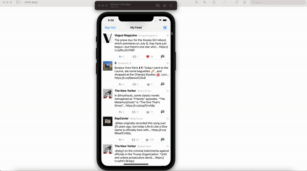
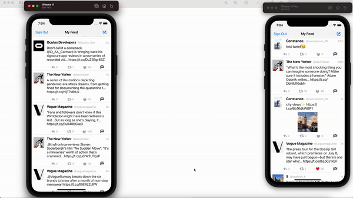

# Project 3 - twitz

**Name of your app** is a simple Twitter client using the [Twitter API](https://apps.twitter.com/).

Time spent: **21** hours spent in total

## User Stories

The following **required** functionality is completed:

- [x] User sees app icon in home screen and styled launch screen
- [x] User can sign in using OAuth login flow
- [x] User can Logout
- [x] User can view last 20 tweets from their home timeline
- [x] In the home timeline, user can view tweet with the user profile picture, username, tweet text, and timestamp.
- [x] User can pull to refresh.
- [x] User can tap the retweet and favorite buttons in a tweet cell to retweet and/or favorite a tweet.
- [x] User can compose a new tweet by tapping on a compose button.
- [x] Using AutoLayout, the Tweet cell should adjust its layout for iPhone 11, Pro and SE device sizes as well as accommodate device rotation.
- [x] User should display the relative timestamp for each tweet "8m", "7h"
- [x] Tweet Details Page: User can tap on a tweet to view it, with controls to retweet and favorite.

The following **optional** features are implemented:

- [ ] User can view their profile in a *profile tab*
  - Contains the user header view: picture and tagline
  - Contains a section with the users basic stats: # tweets, # following, # followers
  - [ ] Profile view should include that user's timeline
- [x] User should be able to unretweet and unfavorite and should decrement the retweet and favorite count. Refer to [[this guide|unretweeting]] for help on implementing unretweeting.
- [ ] Links in tweets are clickable.
- [x] User can tap the profile image in any tweet to see another user's profile
  - Contains the user header view: picture and tagline
  - Contains a section with the users basic stats: # tweets, # following, # followers
- [ ] User can load more tweets once they reach the bottom of the feed using infinite loading similar to the actual Twitter client.
- [x] When composing, you should have a countdown for the number of characters remaining for the tweet (out of 140) (**1 point**)
- [x] After creating a new tweet, a user should be able to view it in the timeline immediately without refetching the timeline from the network.
- [x] User can reply to any tweet, and replies should be prefixed with the username and the reply_id should be set when posting the tweet (**2 points**)
- [x] User sees embedded images in tweet if available
- [ ] User can switch between timeline, mentions, or profile view through a tab bar (**3 points**)
- [ ] Profile Page: pulling down the profile page should blur and resize the header image. (**4 points**)

Please list two areas of the assignment you'd like to **discuss further with your peers** during the next class (examples include better ways to implement something, how to extend your app in certain ways, etc):

1. How to better dynamically size the embedded image inside a Tweet cell (mine is currently a bit small)
2. How to implement infinite loading or caching of previously loaded Tweets

## Video Walkthrough

Here's a walkthrough of implemented user stories:

1. App icon, launch screen, sign in, sign out:

 / ! 

2. Like, retweet, unlike, unretweet (in both timeline and detail views), profile pages of tweet authors

 / ! 

3. Replying to a tweet, composing a new tweet, and "x characters left" count in compose view

 / ! 

4. Autolayout for all views: device rotations [iPhone 11 Pro Max]

 / ! 

5. Autolayout using other devices [iPhone 11, iPhone 11 Pro]

 / ! 

6. Main functionalities (gif #2 and gif #3 combined, lower quality)

 / ! 

GIF created with [ezgif](https://ezgif.com).

## Notes

I struggled with the embedded image story as I didn't know that the mediaURL in Twitter's API didn't apply to the cover pictures of links. Thanks so much to Eliel and Alexis from the teaching team for helping me debug this issue for basically the whole afternoon! :)

## Credits

List an 3rd party libraries, icons, graphics, or other assets you used in your app.

- [AFNetworking](https://github.com/AFNetworking/AFNetworking) - networking task library
- [DateTools] (https://github.com/MatthewYork/DateTools) - streamlines date and time handling in iOS

## License

    Copyright [2021] [Constance Horng]

    Licensed under the Apache License, Version 2.0 (the "License");
    you may not use this file except in compliance with the License.
    You may obtain a copy of the License at

        http://www.apache.org/licenses/LICENSE-2.0

    Unless required by applicable law or agreed to in writing, software
    distributed under the License is distributed on an "AS IS" BASIS,
    WITHOUT WARRANTIES OR CONDITIONS OF ANY KIND, either express or implied.
    See the License for the specific language governing permissions and
    limitations under the License.
